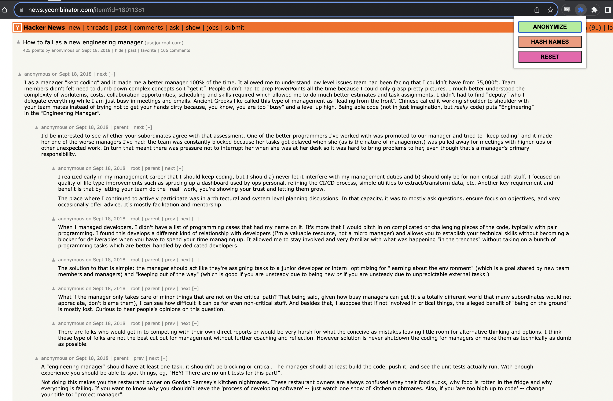
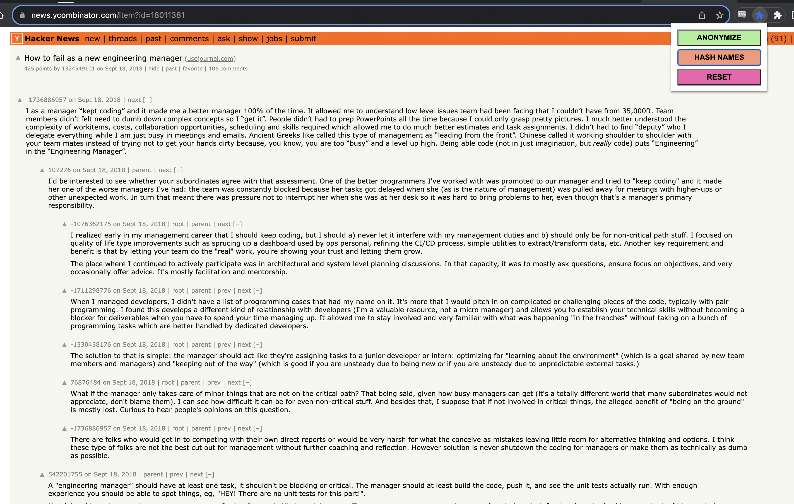

# Anonymize HN

Chrome extension that anonymizes Hacker News usernames.

## Anonymize Usernames

This function replaces all usernames with the string `anonymous`.

## Hash Usernames

This function replaces all usernames with a hash of the username.

